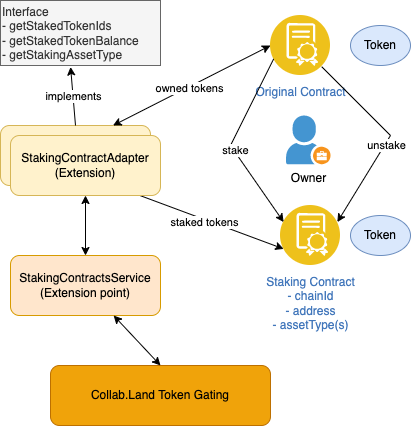

# @collabland/staking-contracts

This project maintains a curated list of stacking contracts for Collab.Land's
token gating capabilities.

## Get started

1. Check out the project

   ```sh
   git clone git@github.com:abridged/collabland-staking-contracts.git
   ```

2. Install dependencies

   ```sh
   npm install
   ```

3. Run the build

   ```sh
   npm run build
   ```

4. Run the example

   ```sh
   node dist/__examples__/main
   ```

## High level architecture



## Add a new staking contract

Please collect the following information for your staking contract:

- Chain id, contract address, and optional asset names (if multiple asset types
  can be staked to the contract) for the staking contract
- Solidity source code and/or ABI for the staking contract
- Chain id and contract address(es) for the original contract containing tokens
  to be staked

### Contribute extension code for your staking contract

To add a new staking contract, please follow the steps below.

1. Add the contract ABI json file, go to `src/contracts` and create a file such
   as `my-abi.json`

2. Run `npm run build` to generate TypeScript client code for the contract

3. Add an adapter class to `src/adapters`:

```ts
import {BindingScope, extensionFor, injectable} from '@loopback/core';
import {BigNumber} from 'ethers';
import {STAKING_ADAPTERS_EXTENSION_POINT} from '../keys';
import {BaseStakingContractAdapter, StakingAsset} from '../staking';
// Use the full path to import instead of `../types`
import {Coco__factory} from '../types/factories/Coco__factory';

@injectable(
  {
    scope: BindingScope.SINGLETON, // Mark the adapter as a singleton
  },
  // Mark it as an extension to staking contracts service
  extensionFor(STAKING_ADAPTERS_EXTENSION_POINT),
)
export class CocoStakingContractAdapter extends BaseStakingContractAdapter {
  /**
   * The contract address
   */
  contractAddress = '0x0Df016Fb18ef4195b2CF9d8623E236272ec52e14';

  /**
   * Assets that can be staked to this contract
   */
  supportedAssets: StakingAsset[] = [
    {
      asset: 'ERC721:0x1A331c89898C37300CccE1298c62aefD3dFC016c',
    },
  ];

  /**
   * Get staked token ids for the given owner
   * @param owner - Owner address
   * @returns
   */
  getStakedTokenIds(owner: string): Promise<BigNumber[]> {
    const contract = Coco__factory.connect(this.contractAddress, this.provider);
    return contract.getStakes(owner);
  }
}
```

4. Register the adapter class to `src/component.ts`

```ts
// Copyright Abridged, Inc. 2022. All Rights Reserved.
// Node module: @collabland/staking-contracts
// This file is licensed under the MIT License.
// License text available at https://opensource.org/licenses/MIT

import {
  Component,
  ContextTags,
  injectable,
  ServiceOrProviderClass,
} from '@loopback/core';
import {CocoStakingContractAdapter} from './adapters/coco.adapter';
import {MtgStakingContractAdapter} from './adapters/mtg.adapter';
import {RirsuStakingContractAdapter} from './adapters/rirsu.adapter';
import {RoboStakingContractAdapter} from './adapters/robo.adapter';
import {SkyFarmContractAdapter} from './adapters/sky-farm.adapter';
import {STAKING_CONTRACTS_COMPONENT} from './keys';
import {StakingContractsService} from './services/staking-contracts.service';

// Configure the binding for StakingContractsComponent
@injectable({
  tags: {[ContextTags.KEY]: STAKING_CONTRACTS_COMPONENT},
})
export class StakingContractsComponent implements Component {
  services: ServiceOrProviderClass<unknown>[] = [
    StakingContractsService,
    CocoStakingContractAdapter,
    MtgStakingContractAdapter,
    RirsuStakingContractAdapter,
    RoboStakingContractAdapter,
    SkyFarmContractAdapter,
  ];
  constructor() {}
}
```

## Submit a pull request

When you contribute code to this project, please check the following steps
before submitting a pull request.

1.  Run the tests

    ```sh
    npm test
    ```

2.  Format the code

    ```sh
    npm run lint:fix
    ```

3.  Sign off commits

    Add a Signed-off-by trailer by the committer at the end of the commit log
    message. The **sign-off** certifies that the committer has the rights to
    submit the work under the project’s license or agrees to a
    [Developer Certificate of Origin (DCO)](http://developercertificate.org).

    See instructions at
    https://git-scm.com/docs/git-commit#Documentation/git-commit.txt--s.

## What's Next?

After your pull request is merged, we'll publish a release of
[this package](https://www.npmjs.com/package/@collabland/staking-contracts) to
npm. The new version will be picked up by Collab.Land servers (QA first, then
production). Community admins can then use the newly added staking contract to
define token gating rules.

## Publish a new release (for maintainers only)

```sh
npm run release
```


